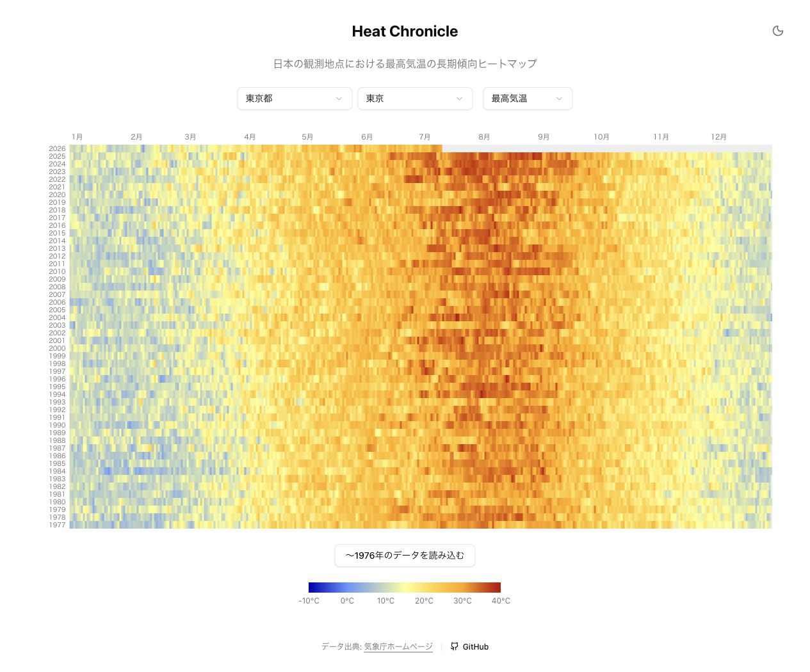

# Heat Chronicle

日本全国 979 か所の気象観測地点から、日別の最高・最低・平均気温を選び、長期的な変化を
年×日付のヒートマップで比較できるWebアプリケーションです。

[公開サイトを見る](https://heat-chronicle.koppepan.org/?pref=44&station=4) ・
[ソースコードを見る](https://github.com/nkoguchi-dev/heat-chronicle)



気象庁の「過去の気象データ検索」から必要な年月だけを取得し、DynamoDBへキャッシュします。
長期間の大量データを扱いながら、外部サイトへの負荷と利用者の待ち時間を抑えることを
テーマに、フロントエンド、API、データ取得、AWSインフラ、CI/CDまで個人で設計・実装しました。

## 技術的な見どころ

### AGENTS.mdとPRレビューガイドによる開発標準化

- [`frontend/AGENTS.md`](./frontend/AGENTS.md) と [`backend/AGENTS.md`](./backend/AGENTS.md) に、アーキテクチャ、命名規則、品質基準、テスト方針を明文化
- [`docs/REVIEW_GUIDE.md`](./docs/REVIEW_GUIDE.md) を起点に、共通・バックエンド・フロントエンド・インフラ別のレビュー観点を整備
- Codexも同じガイドを参照して実装と自己レビューを行い、lint、型検査、テスト、ビルドによって変更を検証
- AIの提案を自動採用するのではなく、既存設計との一貫性や影響範囲を確認してから反映

### AWS上のサーバーレス構成とIaC

- フロントエンドはNext.jsの静的エクスポートをS3 + CloudFrontで配信
- FastAPIをコンテナ化し、Mangum経由でAWS Lambda + API Gateway上に配置
- AWSとGitHub ActionsのリソースをTerraformで管理し、SOPS + ageでtfvarsを暗号化
- GitHub ActionsからAWSへはOIDCで認証し、長期アクセスキーを使用しない

### 継続的な品質管理

- バックエンドはpytestによるユニットテストと、DynamoDB Localを使用するAPI統合テストを分離
- Black、isort、Flake8、mypyによるフォーマット・静的解析・型検査をCIで実行
- フロントエンドはVitestとReact Testing Libraryによるテストに加え、カバレッジ閾値を設定
- Prettier、ESLint、TypeScript、本番ビルドをCIで検証し、変更領域ごとの品質基準を継続的に確認

### DynamoDBキャッシュと鮮度管理

- `daily-temperature` に日別データ、`fetch-log` に地点・年月ごとの取得日時を保存
- 確定済みの過去年月は再取得せず、当月など更新される可能性があるデータだけを24時間後に再取得
- パーティションキーとソートキーを使った期間クエリにより、対象地点・期間のデータだけを取得
- 閲覧された地点からオンデマンドでデータを蓄積し、事前収集に伴う運用コストを抑制

### 外部サイトに配慮したデータ取得

- 気象庁へのリクエストを`JmaClient`に集約し、フロントエンドから2秒以上の間隔で順次取得
- HTTPエラー時は最大3回、指数バックオフでリトライ
- 1リクエストを1か月分に限定し、取得済み年月への重複アクセスをキャッシュで抑制
- 必要な地点・年月だけを順次取得し、気象庁サイトへの集中アクセスを回避

## 担当範囲

個人開発として、以下の工程を一貫して担当しています。

- 要件整理、画面・API・データモデルの設計
- Next.js / Reactによるフロントエンド実装
- FastAPIによるAPIとレイヤードアーキテクチャの実装
- 気象庁データの取得、解析、キャッシュ鮮度管理
- DynamoDBのテーブル・アクセスパターン設計
- TerraformによるAWS / GitHubリソースのコード化
- GitHub Actionsによるテスト、ビルド、デプロイの自動化
- テスト、レビューガイド、運用ドキュメントの整備

## 設計上の判断とトレードオフ

| 判断 | 採用理由 | トレードオフ |
|---|---|---|
| ヒートマップをCanvasで描画 | 数万セルを少ないDOM要素で描画できる | セル単位のアクセシビリティやレスポンシブ制御を別途設計する必要がある |
| 50年ごとの段階取得 | 初回応答とデータ量を抑え、必要な利用者だけが古い期間を取得できる | 全期間を一度に比較するには追加操作が必要になる |
| オンデマンド取得 + DynamoDBキャッシュ | 事前収集の運用コストを抑え、閲覧された地点からデータを蓄積できる | 初回閲覧ではデータ取得完了まで待ち時間が発生する |
| 静的フロントエンド + Lambda API | 常時稼働サーバーを持たず、小規模サービスの運用負荷を抑えられる | Lambdaの実行時間やコールドスタートを考慮する必要がある |
| 気象庁の公開観測データの取得・解析 | 公開画面から必要な年月の観測データを取得できる | HTML変更への追従と、アクセス頻度への慎重な配慮が必要になる |

## アーキテクチャ

```text
┌─────────────────────┐      ┌────────────────────────┐
│ Next.js / Canvas    │─────▶│ API Gateway            │
│ S3 + CloudFront     │ HTTPS│ FastAPI on AWS Lambda  │
└─────────────────────┘      └───────────┬────────────┘
                                         │
                              ┌──────────▼──────────┐
                              │ DynamoDB            │
                              │ data + fetch log    │
                              └──────────┬──────────┘
                                         │ 未取得・要更新の月だけ
                              ┌──────────▼──────────┐
                              │ 気象庁              │
                              │ 過去の気象データ検索 │
                              └─────────────────────┘
```

## 技術スタック

| レイヤー | 技術 |
|---|---|
| フロントエンド | Next.js 16 / React 19 / TypeScript / Tailwind CSS v4 / Canvas 2D API |
| バックエンド | Python 3.14 / FastAPI / Pydantic / httpx / BeautifulSoup4 / Mangum |
| データストア | Amazon DynamoDB / DynamoDB Local |
| インフラ | AWS Lambda / API Gateway / ECR / S3 / CloudFront / Route 53 / Terraform |
| CI/CD | GitHub Actions / AWS OIDC |
| 品質管理 | pytest / moto / Black / isort / Flake8 / mypy / ESLint / TypeScript |

## ディレクトリ構成

```text
heat-chronicle/
├── backend/           # FastAPI、ドメインロジック、DynamoDB、気象庁データ取得・解析
├── frontend/          # Next.js、Canvasヒートマップ、UI
├── infrastructure/    # AWS / GitHub Terraform
├── database/          # DynamoDB Localのデータ
├── docs/              # PRレビューガイド、運用・改善ドキュメント
├── scripts/           # 地点マスタ生成、デプロイ補助
├── .github/workflows/ # CI、デプロイ
├── compose.yaml       # ローカル開発環境
└── AGENTS.md          # AIエージェント向け開発ガイド
```

## ローカル開発

前提: Docker / Docker Compose、Python 3.14 + Poetry、Node.js 22 + npm

```bash
# DynamoDB Local、バックエンド、フロントエンドをまとめて起動
docker compose up
```

個別の開発コマンドと設計ルールは、[`backend/AGENTS.md`](./backend/AGENTS.md) と
[`frontend/AGENTS.md`](./frontend/AGENTS.md) を参照してください。

## CI/CD

PRでは変更領域に応じたCIを実行し、`release/prod` ブランチへのpushでAWSへデプロイします。

- フロントエンド: `npm ci` → ESLint → 静的ビルド → S3同期 → CloudFrontキャッシュ無効化
- バックエンド: 静的解析・ユニットテスト・統合テスト → Docker build → ECR push → Lambda更新

## データ出典

気象データは、気象庁ホームページで公開されている
[「過去の気象データ検索」](https://www.data.jma.go.jp/stats/etrn/index.php)から取得し、
Heat Chronicleが表示用に加工しています。コンテンツの利用にあたっては、
[気象庁ホームページの利用規約](https://www.jma.go.jp/jma/kishou/info/coment.html)に基づき、
出典と加工の事実を明示しています。本サービスは個人開発プロジェクトです。
